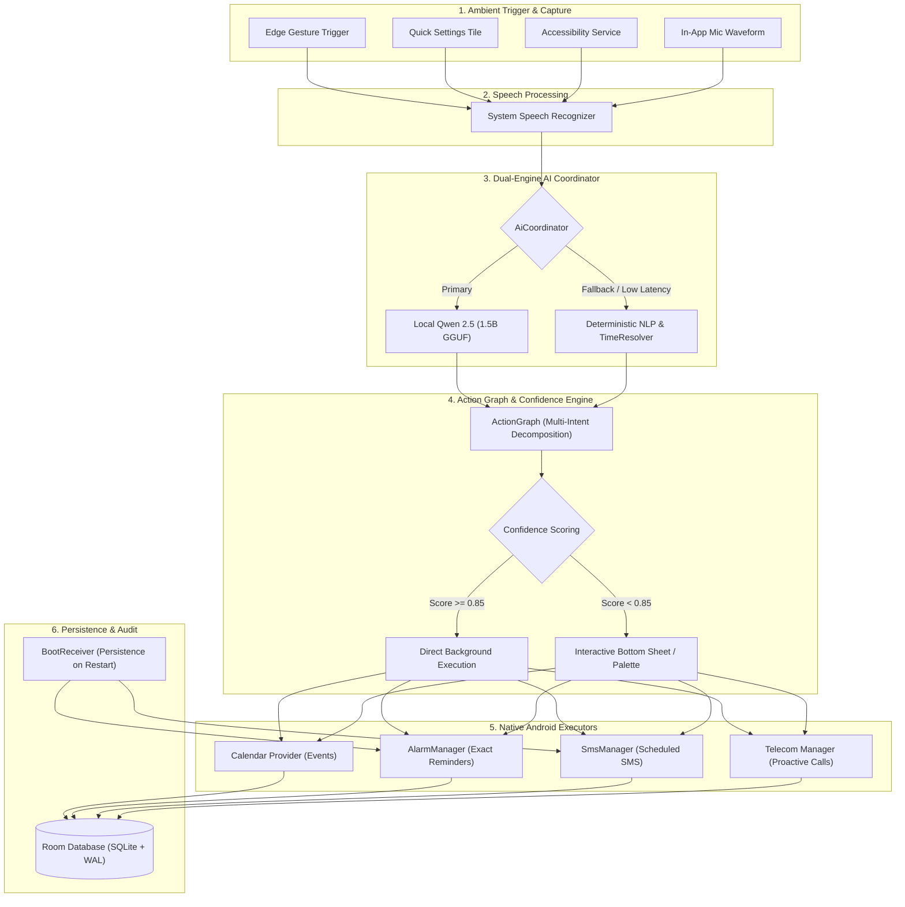

<div align="center">

# 🌊 EchoFlow

**Voice-First Ambient AI Assistant for Android**

*Transform complex spoken thoughts into orchestrated, real-world actions — completely private, ambient, and latency-free.*

---

[-3DDC84?style=flat-square&logo=android&logoColor=white)](https://developer.android.com)
[](https://kotlinlang.org)
[](https://developer.android.com/jetpack/compose)
[](https://m3.material.io)
[](https://developer.android.com/training/data-storage/room)
[](https://huggingface.co/Qwen)
[](LICENSE)

</div>

---

## 📖 Overview

**EchoFlow** is a zero-friction, ambient Android assistant engineered to parse multi-intent natural language into executable action graphs. Instead of requiring users to switch between calendar apps, reminder managers, messaging platforms, and phone dialers, EchoFlow captures natural spoken dictation and decomposes complex thoughts into discrete, scheduled, real-world executions.

Whether activated through an unobtrusive edge gesture, an accessibility shortcut, a Quick Settings tile, or the native app, EchoFlow runs entirely on-device with dual-engine intelligence: a local quantized GGUF LLM and a lightning-fast deterministic fallback parser.

---

## ⚡ Key Features

- 🎙️ **Ambient Multi-Modal Capture**: Activate anywhere via floating overlays, configurable edge-swipe gestures, Quick Settings tile, or accessibility services without interrupting your active workflow.
- 🧠 **Dual-Engine AI Reasoning**:
  - **Local LLM**: Powered by `Qwen2.5-1.5B-Instruct` (quantized Q4_K_M GGUF) running locally via embedded `llama-android` C++ runtime.
  - **Deterministic Rule Engine**: High-throughput regex, NLP tokenizer, and `TimeResolver` engine for instantaneous offline operation with zero battery drain.
- 🔗 **Multi-Intent Action Graphs**: Unrolls compound multi-sentence commands into structured directed graphs containing calendar events, reminders, SMS messages, and phone calls.
- 🎯 **Confidence-Based Autonomy**:
  - **High Confidence (> 0.85)**: Dispatched immediately to background workers.
  - **Medium Confidence (0.60 – 0.85)**: Dispatched with undo notification action palette.
  - **Low Confidence (< 0.60)**: Presents interactive bottom sheets for quick inline adjustments before execution.
- 📅 **Native Android Integrations**:
  - **Calendar**: Direct Android Calendar Provider integration with conflict detection and calendar ID routing.
  - **Reminders**: Accurate system alarms via `AlarmManager.setExactAndAllowWhileIdle` with rich snooze/dismiss notifications.
  - **Scheduled Messages**: Background SMS dispatching with carrier delivery confirmation tracking (`SmsDeliveryReceiver`) and time-drift compensation.
  - **Proactive Calling**: One-tap proactive dialer notifications with telephony integration.
- 🔄 **Reboot Resilience**: Custom `BootReceiver` automatically recalculates and restores all active scheduled actions upon device reboot.
- 🗣️ **Spoken Feedback**: Native Text-To-Speech (TTS) engine generates concise auditory confirmations summarizing scheduled actions.

---

## 🏗️ Architecture & Pipeline



---

## 💡 Multi-Intent Decomposition Example

EchoFlow parses single spoken streams containing multiple interleaved actions and parameters:

### 🗣️ Spoken Input:
> *"The robotics meeting is done. Tomorrow at 4, block one hour to work on the motor controller, remind Rahul to send the CAD files, send Rahul a message at 4:15 saying I'll start integration tomorrow, and call Rahul at 5."*

### 📋 Parsed Action Graph:

| # | Action Type | Details | Scheduled Time | Execution Mode |
|---|---|---|---|---|
| **1** | **Calendar** | `Block 1 hour: Motor controller work` | Tomorrow, 16:00 – 17:00 | Direct Execution |
| **2** | **Reminder** | `Rahul: Send CAD files` | Tomorrow, 16:00 | Alarm Notification |
| **3** | **Message (SMS)** | `To Rahul: "I'll start integration tomorrow"` | Tomorrow, 16:15 | Background Scheduled SMS |
| **4** | **Call** | `Call Rahul` | Tomorrow, 17:00 | Proactive Call Alert |

---

## 🛠️ Tech Stack

| Category | Technology |
|---|---|
| **Language** | Kotlin 2.0+ (100% Kotlin codebase) |
| **UI Framework** | Jetpack Compose, Material 3, Compose Navigation |
| **Concurrency** | Kotlin Coroutines, StateFlow, SharedFlow |
| **Local LLM** | Qwen 2.5 1.5B Instruct (GGUF Q4_K_M) via `llama-android` |
| **Database** | Android Room 2.6 with SQLite WAL mode |
| **JSON Parser** | Google Gson |
| **Scheduling** | Android `AlarmManager`, Foreground Services, BroadcastReceivers |
| **Testing** | JUnit 4, AndroidX Test, Kotlinx Coroutines Test |
| **Build System** | Gradle 8.9+, Gradle Version Catalog (`libs.versions.toml`) |

---

## 📂 Project Structure

```
EchoFlow/
├── app/
│   ├── src/
│   │   ├── main/
│   │   │   ├── AndroidManifest.xml
│   │   │   ├── java/com/echoflow/app/
│   │   │   │   ├── ai/               # Local Qwen LLM, Fallback engine, & Prompt builders
│   │   │   │   ├── ambient/          # Floating window overlays & lifecycle management
│   │   │   │   ├── assistant/        # Accessibility service, tile, & gesture controllers
│   │   │   │   ├── capture/          # Speech recognizer abstraction & listeners
│   │   │   │   ├── confidence/       # Confidence evaluation engine & thresholds
│   │   │   │   ├── data/             # Room Database, DAOs, entities, & Preferences
│   │   │   │   ├── demo/             # Predefined real-pipeline demo test scenarios
│   │   │   │   ├── domain/           # Action graph models, enums, & TimeResolver
│   │   │   │   ├── execution/        # Calendar, SMS, Call, & Reminder executors
│   │   │   │   ├── notification/     # Interactive notification palette managers
│   │   │   │   ├── scheduling/       # Alarm drift handling & BootReceiver
│   │   │   │   ├── ui/               # Jetpack Compose UI (Screens, Theme, Components)
│   │   │   │   └── viewmodel/        # EchoFlowViewModel central state manager
│   │   │   └── res/                  # Drawables, themes, XML configs
│   │   └── test/                     # 13 comprehensive unit & regression test suites
│   └── build.gradle.kts
├── gradle/
│   └── libs.versions.toml            # Dependency version catalogs
├── build.gradle.kts
├── settings.gradle.kts
└── README.md
```

---

## 🔒 Permissions & Security

EchoFlow strictly processes data on-device. The required Android permissions are scoped exclusively to user-commanded operations:

- `RECORD_AUDIO`: Voice capture during active assistant interaction.
- `READ_CALENDAR` / `WRITE_CALENDAR`: Scheduling events directly into local or synced accounts.
- `SCHEDULE_EXACT_ALARM` / `USE_EXACT_ALARM`: Firing exact reminders and scheduled messages on time.
- `SEND_SMS`: Sending scheduled text messages without requiring manual app opening.
- `READ_CONTACTS`: Resolving spoken contact names (e.g., "Rahul") to phone numbers.
- `CALL_PHONE`: Triggering user-initiated calls from proactive notification prompts.
- `RECEIVE_BOOT_COMPLETED`: Rescheduling active alarms following a device reboot.
- `BIND_ACCESSIBILITY_SERVICE`: (Optional) Detecting global edge gestures for ambient summoning.

---

## 🚀 Getting Started

### Prerequisites
- **Android Studio**: Ladybug (2024.2.1) or newer
- **JDK**: Java Development Kit 17
- **Android SDK**: Compile SDK 35, Min SDK 26 (Android 8.0 Oreo+)
- **Device/Emulator**: Physical device recommended for SMS and Accessibility testing

### Building from Source

1. Clone the repository:
   ```bash
   git clone https://github.com/nandu123-1/EchoFlow.git
   cd EchoFlow
   ```

2. Open the project in Android Studio or build via Gradle:
   ```bash
   ./gradlew assembleDebug
   ```

3. (Optional) **Local LLM Model Weights**:
   To enable local neural inference:
   - Download `qwen2.5-1.5b-instruct-q4_k_m.gguf` from Hugging Face.
   - Place the `.gguf` file into the device's internal storage directory (or use EchoFlow's in-app Model Downloader in Settings).
   - If no model is present, EchoFlow automatically activates its built-in, zero-latency **Deterministic Fallback Engine**.

---

## 🧪 Running Tests

The test suite validates multi-intent parsing, temporal resolution, calendar selection, and drift compensation:

```bash
./gradlew testDebugUnitTest
```

### Key Test Suites:
- `ActionParserTest`: Evaluates single and compound intent extraction.
- `TimeResolverTest`: Validates relative and absolute time parsing (e.g. "tomorrow at 4", "in 30 mins").
- `ScheduledMessageExecutionAndStateTest`: Verifies SMS dispatch lifecycle and delivery handling.
- `CalendarSelectionTest`: Tests calendar disambiguation and event insertion.
- `ScheduledActionDriftAndLogicTest`: Verifies time-drift logic under Android power-saving states.

---

## 📄 License

This project is licensed under the Apache License 2.0 - see the [LICENSE](LICENSE) file for details.
